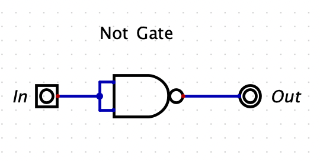
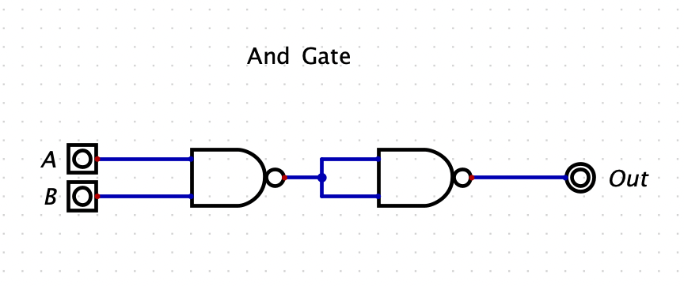
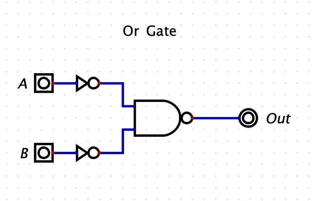
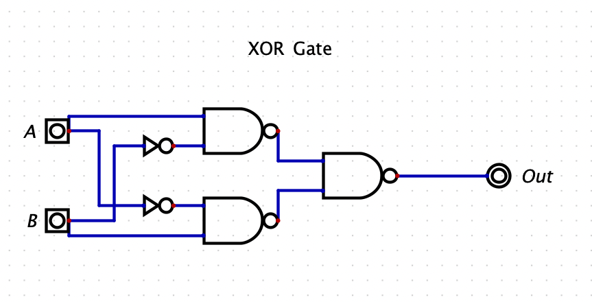
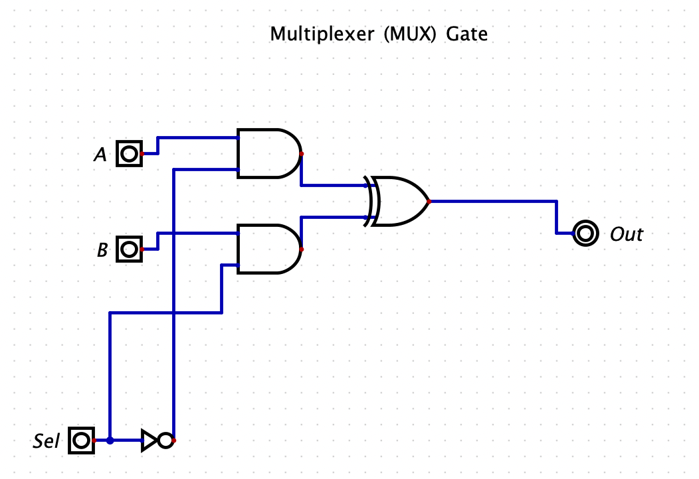
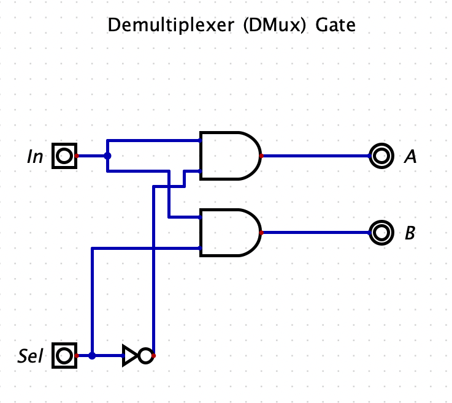

# Boolean Logic

## Boolean Functions
Functions that operate on binary inputs and return binary outputs

## Boolean Operators
The fundamental boolean operators are **AND**, **OR**, and **NOT** which allow one to either broaden or narrow the output of a boolean funtion.

## Truth Tables & Boolean Expressions
Every boolean function can be represented using a truth table which is an enumerated set of input(s) and output(s) for a given boolean expression.

See below for examples of truth tables.

## Logic Gates
"Gates" - also referred to as "chips" - are physical (hardware) devices that implement boolean functions. Generally speaking, most modern day computing systems realize logic gates using electricity for a binary representation of the gates state. For example, 1 = ON & 0 = OFF.

### Primitive & Composite Gates
Primitive gates such as **AND**, **OR**, and **NOT** can be combined to create more complex composite gates made up of multiple chips.

## NAnd Gate
Stands for "Not-And", the **NAnd** gate can be used to create all other gates in almost every modern day computing system.

### NAnd Gate API
|Key|Value|
|---|---|
|Input| `a`, `b` |
|Output| `out` |
|Function| `if ((a == 1) and (b == 1) out == 0 else out == 1` | 

### NAnd Truth Table
| A | B | Out |
|---|---|---|
| 0 | 0 | 1 |
| 0 | 1 | 1 |
| 1 | 0 | 1 |
| 1 | 1 | 0 |

## Not Gate
The **Not** gate is a primitive gate that also known as the "inverter". **Not** will output the opposite of it's input.

### Not Gate API
|Key|Value|
|---|---|
|Input| `in` |
|Output| `out` |
|Function| `if (in == 0) out == 1 else out == 0` | 

### Not Truth Table
| In | Out |
|---|---|
| 0 | 1 |
| 1 | 0 |

### Not Gate Diagram

## And Gate
The **And** gate is a primitive gate that returns `1` when both inputs `a` & `b` are `1`, otherwise it returns `0`.

### And Gate API
|Key|Value|
|---|---|
|Input| `a`, `b` |
|Output| `out` |
|Function| `if ((a == 1) and (b == 1)) out == 1 else out == 0` |

### And Truth Table
| A | B | Out |
|---|---|---|
| 0 | 0 | 0 |
| 0 | 1 | 0 |
| 1 | 0 | 0 |
| 1 | 1 | 1 |
### And Gate Diagram

## Or Gate
The **Or** gate is a primitive gate that returns `1` when either one or both of it's inputs are `1`, otherwise it returns `0`.

### Or Gate API
|Key|Value|
|---|---|
|Input| `a`, `b` |
|Output| `out` |
|Function| `if ((a == 1) or (b == 1)) out == 1 else out == 0` |

### Or Truth Table
| A | B | Out |
|---|---|---|
| 0 | 0 | 0 |
| 0 | 1 | 1 |
| 1 | 0 | 1 |
| 1 | 1 | 1 |

### Or Gate Diagram

## Xor Gate
The **Xor** gate, which stands for "Exclusive Or", is a primitive gate that returns `1` when exactly one of it's inputs are `1`, otherwise it returns `0`.

### Xor Gate API
|Key|Value|
|---|---|
|Input| `a`, `b` |
|Output| `out` |
|Function| `if ((a != b) out == 1 else out == 0` |

### Xor Truth Table
| A | B | Out |
|---|---|---|
| 0 | 0 | 0 |
| 0 | 1 | 1 |
| 1 | 0 | 1 |
| 1 | 1 | 0 |

### Xor Gate Diagram

## Multiplexer (Mux) Gate
The **Mux** gate is a three-input gate where there are two input (data) bits, `a` & `b` and a single `sel` bit which is known as the "selection" bit. The `sel` bit determines whether the output to be used is either `a` or `b`.

### Mux Gate API
|Key|Value|
|---|---|
|Input| `a`, `b`, `sel` |
|Output| `out` |
|Function| `if (sel == 0) out = a else out == b` |

### Mux Truth Table
| A | B | Sel | Out |
|---|---|---|---|
| 0 | 0 | 0 | 0 |
| 0 | 1 | 0 | 0 |
| 1 | 0 | 0 | 1 |
| 1 | 1 | 0 | 1 |
| 0 | 0 | 1 | 0 |
| 0 | 1 | 1 | 1 |
| 1 | 0 | 1 | 0 |
| 1 | 1 | 1 | 1 |

### Mux Gate Diagram

## Demultiplexer (DMux) Gate
The **DMux** gate is the opposite of a **Mux** gate in that it has a single (data) input, a `sel` bit, and two possible outputs - `a` & `b`. The output is routed to either `a` or `b` depending on the value of the `sel` bit and the other output is set to `0`.

### DMux Gate API
|Key|Value|
|---|---|
|Input| `in`, `sel` |
|Output| `a`, `b` |
|Function| `if (sel == 0) {a, b} = {in, 0} else {a, b} = {0, in}` |

### DMux Truth Table
| Sel | A | B |
|---|---|---|
| 0 | in | 0 |
| 1 | 0 | in |

### DMux Gate Diagram
