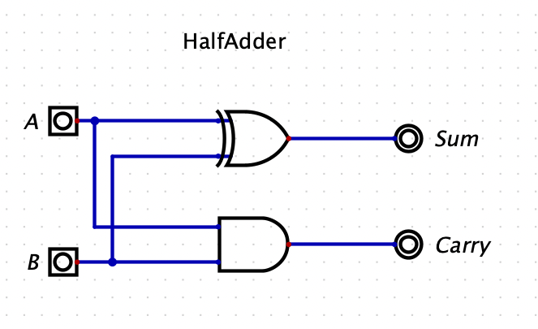
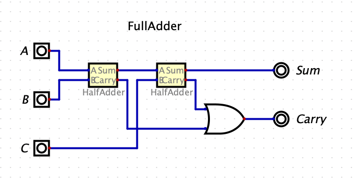

# Boolean Arithmetic

### HalfAdder
The **HalfAdder** chip is used to add binary digits and output a 2-bit number.

### HalfAdder Chip API
|Key|Value|
|---|---|
|Input| `a`, `b` |
|Output| `carry`, `sum` |
|Function| `sum = LSB of a + b, carry = MSB of a + b` |

### HalfAdder Truth Table
| A | B | Carry | Sum |
|---|---|---|---|
| 0 | 0 | 0 | 0 |
| 0 | 1 | 0 | 1 |
| 1 | 0 | 0 | 1 |
| 1 | 1 | 1 | 0 |

### HalfAdder Chip Diagram

### FullAdder
The **FullAdder** chip is designed to sum 3 bits, `a`, `b`, and `c`. This is a composite chip where this particular implementation is comprised of 2 **HalfAdder** chips and an **Or** chip.

### FullAdder Chip API
|Key|Value|
|---|---|
|Input| `a`, `b`, `c` |
|Output| `carry`, `sum` |
|Function| `sum = LSB of a + b + c, carry = MSB of a + b + c` |

### FullAdder Truth Table
| A | B | C | Carry | Sum |
|---|---|---|---|---|
| 0 | 0 | 0 | 0 | 0 |
| 0 | 0 | 1 | 0 | 1 |
| 1 | 0 | 0 | 0 | 1 |
| 0 | 1 | 1 | 1 | 0 |
| 1 | 0 | 0 | 0 | 1 |
| 1 | 0 | 1 | 1 | 0 |
| 1 | 1 | 0 | 1 | 0 |
| 1 | 1 | 1 | 1 | 1 |

### FullAdder Chip Diagram

